<!-- ═══════════════════════════ BANNER ═══════════════════════════ -->
<p align="center">
  
</p>

<!-- ═══════════════════════════ TYPING ═══════════════════════════ -->
<p align="center">
  <a href="https://github.com/santullo">
    
  </a>
</p>

<p align="center">
  <a href="https://www.linkedin.com/in/gabriel-santullo-rocha/"></a>
  <a href="https://www.instagram.com/gabriel.santullo/"></a>
  
</p>

<br>

<!-- ═══════════════════════════ SOBRE MIM ═══════════════════════════ -->
## `> sobre_mim`

Sou **Gabriel Santullo Rocha Lima**, desenvolvedor pleno na **Memora Processos Inovadores**, onde estou há cerca de 4 anos.

Trabalho nos sistemas da **PGE-GO** e do **IPHAN**. Boa parte do meu dia é dedicada a sistemas legados: entender o que já existe, corrigir e melhorar sem quebrar o que está em produção. A outra parte é tirar esses sistemas do passado e levá-los para uma stack atual.

```java
var gabriel = new Desenvolvedor(
    "Gabriel Santullo Rocha Lima",
    "Desenvolvedor Pleno",
    "Memora Processos Inovadores"   // ~4 anos
);

gabriel.atuaEm("PGE-GO", "IPHAN");

gabriel.migra(
    Stack.of("Java 8",  "Angular 6 + Material", "Oracle"),   // legado
    Stack.of("Java 21", "Angular 17 + PrimeNG", "Oracle")    // novo
);
```

<br>

<!-- ═══════════════════════════ TECNOLOGIAS ═══════════════════════════ -->
## `> stack`

<table align="center">
  <tr>
    <td align="center" width="96">
      
      <br><sub>Java 8+</sub>
    </td>
    <td align="center" width="96">
      
      <br><sub>Spring Boot</sub>
    </td>
    <td align="center" width="96">
      
      <br><sub>Angular</sub>
    </td>
    <td align="center" width="96">
      
      <br><sub>Oracle</sub>
    </td>
    <td align="center" width="96">
      
      <br><sub>PostgreSQL</sub>
    </td>
    <td align="center" width="96">
      
      <br><sub>Git</sub>
    </td>
    <td align="center" width="96">
      
      <br><sub>Jenkins</sub>
    </td>
  </tr>
</table>

<p align="center">
  
  
  
</p>

<br>

<!-- ═══════════════════════════ PROJETOS ═══════════════════════════ -->
## `> projetos`

<p align="center">
  <a href="https://github.com/santullo/docker-manager">
    
  </a>
  <a href="https://github.com/santullo/demo">
    
  </a>
</p>
<p align="center">
  <a href="https://github.com/santullo/exceptions-java">
    
  </a>
</p>

<br>

<!-- ═══════════════════════════ GITHUB STATS ═══════════════════════════ -->
## `> github`

<p align="center">
  
  
</p>

<p align="center">
  
</p>

<p align="center">
  
</p>

<!-- ═══════════════════════════ TROFÉUS ═══════════════════════════ -->
<p align="center">
  
</p>

<br>

<!-- ═══════════════════════════ SNAKE ═══════════════════════════ -->
<p align="center">
  <picture>
    <source media="(prefers-color-scheme: dark)" srcset="https://raw.githubusercontent.com/santullo/santullo/output/github-snake-dark.svg" />
    <source media="(prefers-color-scheme: light)" srcset="https://raw.githubusercontent.com/santullo/santullo/output/github-snake.svg" />
    
  </picture>
</p>

<br>

<!-- ═══════════════════════════ CONTATO ═══════════════════════════ -->
## `> contato`

<p align="center">
  <a href="https://www.linkedin.com/in/gabriel-santullo-rocha/">
    
  </a>
  <a href="https://www.instagram.com/gabriel.santullo/">
    
  </a>
  <a href="mailto:rochasantullo@gmail.com">
    
  </a>
</p>

<!-- ═══════════════════════════ RODAPÉ ═══════════════════════════ -->
<p align="center">
  <sub><code>// legado não é problema. é ponto de partida.</code></sub>
</p>

<p align="center">
  
</p>
